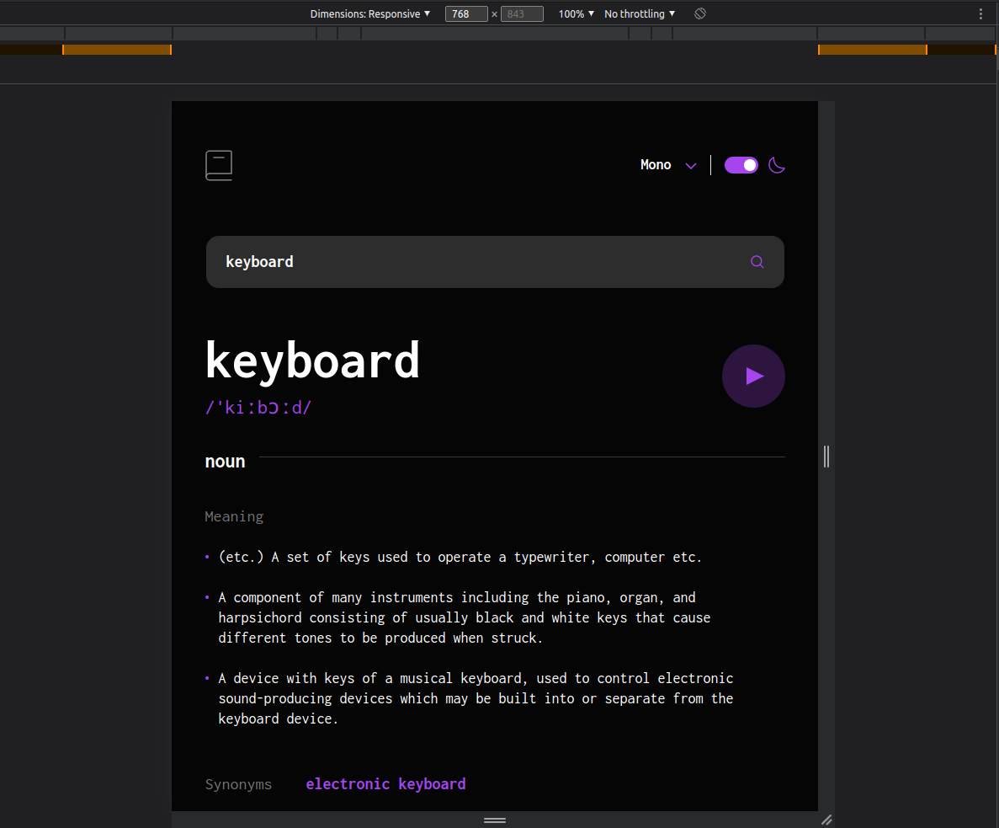

# Frontend Mentor - Dictionary web app solution

This is a solution to the [Dictionary web app challenge on Frontend Mentor](https://www.frontendmentor.io/challenges/dictionary-web-app-h5wwnyuKFL). Frontend Mentor challenges help you improve your coding skills by building realistic projects. 

## Table of contents

- [Overview](#overview)
  - [The challenge](#the-challenge)
  - [Screenshot](#screenshot)
  - [Links](#links)
- [My process](#my-process)
  - [Built with](#built-with)
  - [What I learned](#what-i-learned)
- [Author](#author)
- [Acknowledgments](#acknowledgments)

## Overview

### The challenge

Users should be able to:

- Search for words using the input field
- See the Free Dictionary API's response for the searched word
- See a form validation message when trying to submit a blank form
- Play the audio file for a word when it's available
- Switch between serif, sans serif, and monospace fonts
- Switch between light and dark themes
- View the optimal layout for the interface depending on their device's screen size
- See hover and focus states for all interactive elements on the page
- **Bonus**: Have the correct color scheme chosen for them based on their computer preferences.
### Screenshot

### Links

- Solution URL - unfortunately here the screenshot taken by FE Mentor is not 100% matching the reality, so it's not quite possible to compare it with the design - as it lacks some styling that is present on the live site - better check and compare it with the live site...enough talk, the solution posted on FE mentor is here: [Frontend Mentor](https://www.frontendmentor.io/solutions/dictionary-web-app-react-XJjzcyUarm)
- Live Site URL: [Dictionary Web App - GH Pages](https://tomthestrom.github.io/fe-mentor-dictionary/)

## My process

### Built with

- Semantic HTML5 markup
- CSS custom properties
- Flexbox
- CSS Grid
- Mobile-first workflow
- [React](https://reactjs.org/) - JS library
- [SCSS](https://sass-lang.com/) - CSS extension language

### What I learned

This was my first time using React, having just completed the tutorial at [react.dev](https://react.dev/learn). I also brushed up on my (S)CSS skills, which I've not used for a while. :)

## Author

- Frontend Mentor - [@tomthestrom](https://www.frontendmentor.io/profile/tomthestrom)
